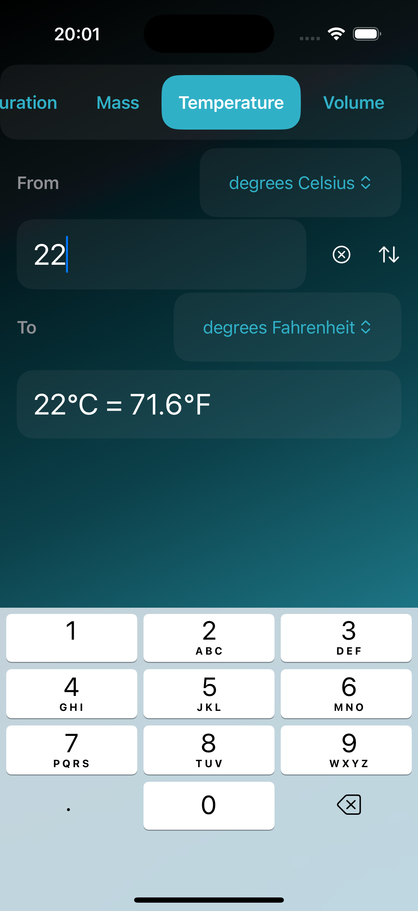

# Convert

## This is a SwiftUI iOS app that was built with TDD.

### 📌 Overview
- I've taken a tvOS UIKit tutorial from [Hacking With Swift](https://www.hackingwithswift.com/articles/110/build-a-unit-converter-for-tvos) as a starting point.
- This app can convert distance, duration, mass, temperature or volume units.
- Written in Swift 5 for iOS 18.
- I've used XCTest for the unit and UI tests.

### 📲 Getting started
1. Clone the repo.
2. Open `Convert.xcodeproj`.
3. Build and run.

### 📱 Screenshots

  
  
  

